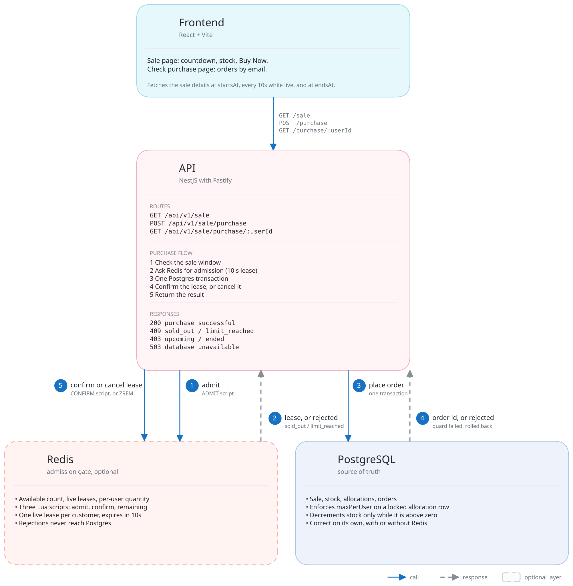

# Flash Sale

A flash sale for one product with limited stock and a per-user limit. Postgres holds stock and orders and decides every purchase. Redis sits in front as an admission gate: it rejects requests that cannot succeed before they reach the database.

```
api/      NestJS (Fastify) API, Docker Compose for Postgres and Redis, migrations, seed scripts, tests
web/      React frontend (Vite)
stress/   k6 load scenarios
```

## System diagram



- **Postgres** stores stock, per-user quantity, and orders. It enforces every rule with row locks and guarded updates. It is correct with or without Redis.
- **Redis** filters requests. One Lua script checks the available count, live leases, and per-user quantity, and decides whether a request gets a database transaction. During a spike, requests that cannot succeed get a `409` from Redis in under a millisecond and never reach Postgres.
- **The API** keeps no state except the sale details loaded at startup. You can run more instances behind a load balancer without coordination. Redis keys carry a hash tag, so the scripts also work on Redis Cluster.

## Design choices and trade-offs

| Choice | Why | Cost |
|---|---|---|
| Postgres decides, Redis filters | Overselling cannot be undone, so one database holds stock and orders and makes every decision. Nothing needs to be reconciled later. | Every committed order updates the same stock row, so orders commit one at a time. Rejections are cheap because Redis answers them without a transaction. |
| Admission by expiring lease, not a counter | The API takes a lease before the transaction and confirms or cancels it after. A lease that is never settled expires on its own. No sweeper, no timers, no counter that drifts. | A request that crashes mid-way leaves its lease behind for up to 10 seconds. The gate counts that lease as one admission in use, so near the end of a sale one customer may be told `sold_out` slightly early. Postgres stock is untouched. |
| Per-user limit enforced twice | Redis rejects repeat buyers in under a millisecond. Postgres enforces the same rule on a locked allocation row, so it holds if Redis is wrong or absent. | The rule exists in Lua and in SQL. A change touches both. Postgres wins when they disagree. |
| Fail open when Redis is down | The sale keeps selling. Postgres still enforces every rule. The connection pool caps concurrent transactions at 10, so the database sees bounded load. | Rejections get slow during an outage because each one becomes a transaction. |
| One sale, loaded once at startup | No admin API and no cache invalidation. The API reads the sale details from Postgres at boot and reads stock live on every request. | Changing the window, price, or stock requires a reset script and a restart. |
| Frontend refreshes on sale timings | The page fetches the sale details at `startsAt`, every 10 seconds while it is live, and at `endsAt`. Then it stops. Buy Now turns on and off by itself, and the stock count stays current. Countdowns use `serverTime`, not the browser clock. | The stock count can be up to 10 seconds old. Whether you get an item is decided when you press Buy Now, not by the count on screen. |

## Build and run

### Prerequisites

- Node 24. `.nvmrc` is set, so `nvm use` picks it.
- Docker with Compose, for Postgres, Redis, and k6.

### Server

```sh
cd api
cp .env.example .env            # defaults work for local development
docker compose up -d            # Postgres on 5433, Redis on 6379
npm install
npm run db:migrate              # create tables (idempotent)
npm run db:seed                 # create the sale from db/seed-data.ts and .env
npm run start:dev               # http://localhost:3000, restarts on change
```

Production build:

```sh
npm run build && npm run start:prod
```

Check it:

```sh
curl localhost:3000/api/health
curl localhost:3000/api/v1/sale
```

### Frontend

```sh
cd web
npm install
npm run dev                     # http://localhost:5173, proxies /api to :3000
```

`npm run build` writes a static bundle to `web/dist`. The frontend has no configuration. The proxy target is in `vite.config.ts`.

### Configuration

Docker Compose, the API, the database scripts, and the tests all read `api/.env`.

| Variable | Default | Purpose |
|---|---|---|
| `POSTGRES_HOST`, `POSTGRES_PORT` | `localhost`, `5433` | Where the API connects. Docker Compose publishes the Postgres container on `POSTGRES_PORT`. 5433 avoids a locally installed Postgres on 5432. |
| `POSTGRES_USER`, `POSTGRES_PASSWORD`, `POSTGRES_DB` | `flashsale` | Credentials for Docker Compose and the API. |
| `REDIS_URL` | `redis://localhost:6379` | Admission gate. |
| `PORT` | `3000` | API port. |
| `SALE_START`, `SALE_END` | now, now + 24h | Sale window, ISO 8601. `SALE_END` MUST be after `SALE_START`. |

Only the sale window comes from the environment. Product, price, stock, and per-user limit are constants in `api/db/seed-data.ts`.

### Adjusting the sale

The API loads the sale from Postgres once at startup. After changing `api/.env` or `api/db/seed-data.ts`, you MUST run a script and restart the API:

```sh
cd api
npm run sale:reset              # or db:seed, see below
# restart the API
```

| Script | What it does | When to use |
|---|---|---|
| `db:seed` | Upserts product, sale window, price, and limit. Leaves orders and remaining stock untouched. | First run. Changing the window or price mid-sale. |
| `sale:reset` | Deletes the sale's orders and allocations, resets stock to the seed value (or `STOCK=<n>` for one run), and resets the Redis gate. | A fresh demo or a stress test. Destructive. |

Redis caches "items still available". The API seeds it from Postgres at startup if the key is missing, and reseeds it if the key disappears mid-sale. `sale:reset` clears it so the new stock takes effect.

Example: a five-minute sale with 100 items starting in two minutes.

```sh
# api/.env
SALE_START=2026-09-12T10:02:00Z
SALE_END=2026-09-12T10:07:00Z
```

```ts
// api/db/seed-data.ts
export const SALE_ITEM = { ..., stock: 100, maxPerUser: 1 };
```

```sh
cd api && npm run sale:reset && npm run start:dev
```

## API

All routes are under `/api/v1` except health.

### `GET /api/health`

```json
{ "ok": true }
```

### `GET /api/v1/sale`

The current sale, its status, and remaining stock.

```json
{
  "id": "flash-sale-1",
  "name": "Flash Sale",
  "status": "active",
  "startsAt": "2026-09-12T10:02:00.000Z",
  "endsAt": "2026-09-12T10:07:00.000Z",
  "serverTime": "2026-09-12T10:03:12.481Z",
  "item": {
    "productId": "limited-sneaker",
    "name": "Limited Edition Sneaker",
    "priceCents": 19900,
    "salePriceCents": 9999,
    "maxPerUser": 1,
    "remainingStock": 87
  }
}
```

`status` is `upcoming`, `active`, `sold_out`, or `ended`. Clients SHOULD compute countdowns from `serverTime`, not from their own clock. Prices are integer cents.

### `POST /api/v1/sale/purchase`

```json
{ "userId": "alice@example.com" }
```

The API trims and lower-cases `userId`. It accepts any non-empty string up to 254 characters. There is no authentication.

| HTTP | Body | Meaning |
|---|---|---|
| 200 | `{ "result": "success", "orderId": 42 }` | Order placed. |
| 409 | `{ "result": "rejected", "reason": "limit_reached" }` | User already holds `maxPerUser` items. |
| 409 | `{ "result": "rejected", "reason": "sold_out" }` | No stock left. |
| 403 | `{ "result": "rejected", "reason": "upcoming" }` | Sale has not started. |
| 403 | `{ "result": "rejected", "reason": "ended" }` | Sale is over. |
| 400 | validation error | Missing or invalid `userId`. |
| 503 | | Database unavailable. |

### `GET /api/v1/sale/purchase/:userId`

```json
{
  "purchased": true,
  "maxPerUser": 1,
  "orders": [{ "orderId": 42, "priceCents": 9999, "purchasedAt": "2026-09-12T10:03:15.102Z" }]
}
```

## Tests

```sh
cd api
npm test                        # unit, no services needed
npm run test:integration        # needs Postgres and Redis (docker compose up -d)
npm run test:e2e                # needs Postgres, Redis, and a seeded sale

cd web
npm test                        # pure logic: refresh scheduling, countdown and money formatting
```

- **Unit** tests run the purchase service against in-memory fakes of the gate, repositories, and transaction runner. They cover the reseed and fail-open paths.
- **Integration** tests run the real Lua scripts against Redis (concurrency, lease expiry, one live lease per user) and the real transaction against Postgres with the gate disabled (200 users for 5 items; 50 attempts by one user with a limit of 3).
- **E2E** tests boot the whole app on Fastify and exercise the HTTP contract, including a purchase that succeeds after an earlier lease expires.

Integration and e2e tests create their own sale rows or clean up what they add. They can run against the development database.

## Stress tests

k6 scenarios live in `stress/`. They run through the `k6` service in Docker Compose, so you install nothing. Each scenario answers one question. Its pass conditions are k6 thresholds: the run exits with 0 when successful and non-zero when any fails.

Run every command below from `api/`. The API MUST be running compiled. You MUST reset the sale before every scenario.

```sh
cd api
npm run build && npm run start:prod                           # in one terminal

npm run sale:reset && npm run stress:spike                    # 2,000 customers buy at once, 100 items
npm run sale:reset && npm run stress:hammer                   # 50 customers x 20 concurrent requests each
STOCK=100000 npm run sale:reset && npm run stress:sustained   # 1,000 purchases/s for 10s
```

| Scenario | Question | Pass conditions |
|---|---|---|
| `spike.js` | Can a burst of customers oversell limited stock? | orders == stock, remaining stock 0, no customer above `maxPerUser` |
| `hammer.js` | Can one customer beat `maxPerUser` by racing themselves? | orders == customers, every customer has exactly `maxPerUser` orders in Postgres |
| `sustained.js` | How many committed orders per second hold over time? | no dropped requests, stock never runs out |

Every scenario also requires zero unexpected responses and zero failed purchase requests. Latency is reported for information only.

Parameters are environment variables: `USERS`, `STOCK`, `CONCURRENCY`, `RATE`, `DURATION`. Pass them to Docker Compose directly. `STOCK` MUST match the value the sale was reset with. For the sustained run, `STOCK` MUST exceed `RATE` times `DURATION`.

```sh
cd api
STOCK=100000 npm run sale:reset
docker compose run --rm -e RATE=2000 k6 run /stress/sustained.js                    # change the rate
docker compose run --rm -e RATE=1500 -e DURATION=20s k6 run /stress/sustained.js   # rate and duration
```

### Expected outcome

A passing run prints `PASS` on its first line, then every condition by name.

Spike, 2,000 customers for 100 items:

```
=== spike: PASS ===

Correctness
PASS  http_req_failed{name:purchase} rate==0
PASS  no customer above max per user
PASS  purchase_success count==100
PASS  purchase_unexpected count==0
PASS  remaining stock is zero

Outcomes
success                          100
sold_out                       1,900
limit_reached                      0
unavailable (503)                  0
unexpected                         0

Performance (informational, this machine only)
purchase p50                 14.1 ms
purchase p95                 43.9 ms
purchase max                157.8 ms
```

Hammer, 50 customers sending 20 requests each:

```
=== hammer: PASS ===

Correctness
PASS  every customer has exactly max per user orders
PASS  http_req_failed{name:purchase} rate==0
PASS  purchase_sold_out count==0
PASS  purchase_success count==50
PASS  purchase_unexpected count==0

Outcomes
success                           50
sold_out                           0
limit_reached                    950
unavailable (503)                  0
unexpected                         0

Performance (informational, this machine only)
purchase p50                  8.2 ms
purchase p95                 24.6 ms
purchase max                 75.7 ms
```

Sustained, 1,000 purchases per second for 10 seconds. This one adds a Traffic section because request rates only mean something for a run held at a steady rate:

```
=== sustained: PASS ===

Correctness
PASS  dropped_iterations count==0
PASS  http_req_failed{name:purchase} rate==0
PASS  purchase_unexpected count==0
PASS  remaining stock not negative
PASS  stock never ran out

Traffic
HTTP requests                 10,003
HTTP throughput                999/s
purchase attempts             10,001
purchase throughput            999/s
successful purchases           999/s
dropped iterations                 0

Outcomes
success                       10,001
sold_out                           0
limit_reached                      0
unavailable (503)                  0
unexpected                         0

Performance (informational, this machine only)
purchase p50                  1.4 ms
purchase p95                  2.4 ms
purchase max                 33.3 ms
```

To confirm the pass conditions against the database itself, query Postgres in the Docker Compose container after a run:

```sh
cd api
docker compose exec postgres psql -U flashsale -d flashsale -c "
  SELECT count(*) AS orders,
         count(DISTINCT user_id) AS buyers,
         max(quantity) AS max_per_buyer,
         (SELECT stock FROM sale_items) AS stock_left
  FROM orders
  LEFT JOIN sale_allocations USING (sale_id, product_id, user_id);"
```

After the spike: 100 orders, 100 buyers, `max_per_buyer` 1, `stock_left` 0. After the hammer: 50, 50, 1, and 50 left.

To find the throughput limit, run the sustained scenario with a higher `RATE` until `dropped_iterations` fails. The last passing rate is the limit.

Sample from my machine, running the API, Postgres, Redis, and k6 together:

| `RATE` | Result | Purchase p95 |
|---|---|---|
| 1000 | PASS, 10,000 orders, 0 dropped | 2.0 ms |
| 1500 | PASS, 15,000 orders, 0 dropped | 3.1 ms |
| 2000 | FAIL, 1,849/s achieved, 561 dropped | 547 ms |

The limit on my machine is about 1,500 orders per second. Your numbers will differ.

### Redis down

Stop Redis and run the spike. The API falls through to Postgres, which still enforces every rule.

```sh
cd api
npm run sale:reset
docker compose stop redis
npm run stress:spike
docker compose start redis
```

Expected: the correctness conditions pass and only latency changes.

```
=== spike: PASS ===

Correctness
PASS  http_req_failed{name:purchase} rate==0
PASS  no customer above max per user
PASS  purchase_success count==100
PASS  purchase_unexpected count==0
PASS  remaining stock is zero

Outcomes
success                          100
sold_out                       1,900
limit_reached                      0
unavailable (503)                  0
unexpected                         0

Performance (informational, this machine only)
purchase p50               1492.6 ms
purchase p95               1529.4 ms
purchase max               1537.6 ms
```

The same run with Redis up has a p95 of about 39 ms. With Redis stopped, all 2,000 requests reach Postgres and wait for one of the 10 pooled connections, so every request takes about 1.5 seconds. The API log shows one `gate unavailable` warning per request.
